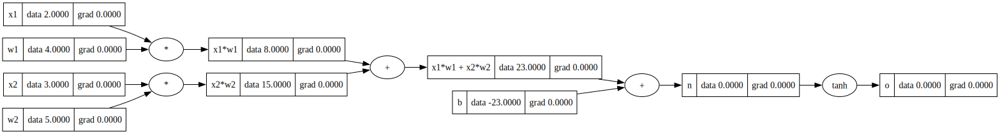
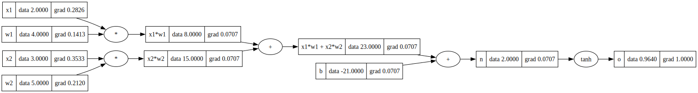

# 反向传播笔记：从 `topo` 到 `backward`

这段代码的目标是：从最终输出 `o` 开始，把 `o` 对每个中间变量、输入变量的影响算出来。

图里每个节点的 `grad` 表示：

```python
grad = do / d当前节点
```

也就是“最终输出 `o` 对这个节点的导数”。

## 1. 前向传播在算什么

当前这个小神经元可以写成：

```python
x1w1 = x1 * w1
x2w2 = x2 * w2
x1w1x2w2 = x1w1 + x2w2
n = x1w1x2w2 + b
o = tanh(n)
```

合起来就是：

```python
o = tanh(x1*w1 + x2*w2 + b)
```

前向传播只负责算 `data`，例如：

```python
x1.data
w1.data
x1w1.data
n.data
o.data
```

对应的计算图大概长这样，节点里同时显示了 `data` 和 `grad`：


## 2. `topo` 是干什么的

```python
topo = []
visited = set()

def build_topo(v):
  if v not in visited:
    visited.add(v)
    for child in v._prev:
      build_topo(child)
    topo.append(v)

build_topo(o)
topo
```

这段是在做拓扑排序。

它会从输出节点 `o` 出发，递归找到所有前面的节点，并且保证：

```python
孩子节点先进入 topo
父节点后进入 topo
```

所以 `topo` 的顺序大概是：

```python
x1, w1, x2, w2, b, ..., n, o
```

但反向传播要从输出往输入走，所以真正 backward 时要反过来：

```python
for node in reversed(topo):
  node._backward()
```

## 3. 为什么先写 `o.grad = 1.0`

因为我们要求的是：

```python
do / d每个节点
```

而输出 `o` 对自己的导数是：

```python
do / do = 1
```

所以反向传播的起点是：

```python
o.grad = 1.0
```

如果你把它改成：

```python
o.grad = 2.0
```

那就相当于在看 `2 * o` 对所有变量的梯度，所有梯度都会整体放大 2 倍。

完整跑一遍 backward 后，梯度会从 `o` 一层层传回输入端：


如果顺序跑错，例如先跑前面的乘法节点，它们还没有拿到上游梯度，所以梯度传不下去：



按输出到输入的顺序手动跑，结果就会正常：


## 4. 加法节点的反向传播规律

如果：

```python
out = a + b
```

那么：

```python
dout/da = 1
dout/db = 1
```

所以反向传播时，加法节点会把上游梯度原样分给两个输入：

```python
a.grad += 1.0 * out.grad
b.grad += 1.0 * out.grad
```

例子：

```python
n = x1w1x2w2 + b
```

如果：

```python
n.grad = 2
```

那么：

```python
x1w1x2w2.grad = 2
b.grad = 2
```

一句话：

```python
加法：梯度原样分发
```

## 5. 乘法节点的反向传播规律

如果：

```python
out = a * b
```

那么：

```python
dout/da = b
dout/db = a
```

所以反向传播时：

```python
a.grad += b.data * out.grad
b.grad += a.data * out.grad
```

例子：

```python
x1w1 = x1 * w1
```

假设：

```python
x1.data = 2
w1.data = 4
x1w1.grad = 3
```

那么：

```python
x1.grad = 3 * 4 = 12
w1.grad = 3 * 2 = 6
```

一句话：

```python
乘法：传给谁，就乘另一个输入的 data
```

注意这个直觉很重要：

```python
w1.grad = 上游梯度 * x1.data
```

权重 `w1` 的梯度跟输入 `x1` 有关。如果 `x1.data = 0`，那么这一次 `w1.grad` 就会是 0。

## 6. `tanh` 节点的反向传播规律

如果：

```python
o = tanh(n)
```

那么：

```python
do/dn = 1 - tanh(n)^2
```

因为：

```python
o.data = tanh(n)
```

所以代码里可以写成：

```python
n.grad += (1 - o.data**2) * o.grad
```

也就是：

```python
n.grad = 上游梯度 * (1 - o.data**2)
```

`tanh` 的影响可以这样看：

```python
n = 0  -> tanh(0) ≈ 0.00  -> 梯度系数 ≈ 1.00
n = 1  -> tanh(1) ≈ 0.76  -> 梯度系数 ≈ 0.42
n = 2  -> tanh(2) ≈ 0.96  -> 梯度系数 ≈ 0.07
n = 3  -> tanh(3) ≈ 1.00  -> 梯度系数 ≈ 0.01
```

结论：

```python
tanh 越接近 1 或 -1，梯度越接近 0
```

这叫激活函数饱和，容易导致梯度变小。

## 7. 链式法则：反向传播的核心

比如 `w1` 影响 `o` 的路径是：

```python
w1 -> x1*w1 -> x1*w1 + x2*w2 -> n -> o
```

所以：

```python
do/dw1
= do/dn
  * dn/d(x1w1x2w2)
  * d(x1w1x2w2)/d(x1w1)
  * d(x1w1)/dw1
```

如果设置：

```python
o.grad = 3
n = 0
x1 = 2
w1 = 4
```

那么：

```python
do/dw1 = 3 * 1 * 1 * x1
       = 3 * 1 * 1 * 2
       = 6
```

这就是图里 `w1.grad` 的来源。

## 8. 为什么 `_backward` 里应该用 `+=`

如果一个变量被用到了多次，比如：

```python
a = Value(3.0, label='a')
b = a + a
```

数学上：

```python
b = 2a
db/da = 2
```

所以 `a.grad` 应该是 2。

如果 `_backward` 里写的是：

```python
self.grad = ...
other.grad = ...
```

可能会覆盖之前的梯度。

更正确的是累加：

```python
self.grad += ...
other.grad += ...
```

因为同一个变量可能通过多条路径影响输出，每条路径的梯度都要加起来。

## 9. 推荐实验

### 实验 A：让数字更直观

让：

```python
n = x1*w1 + x2*w2 + b = 0
```

可以选：

```python
x1 = 2
w1 = 4
x2 = 3
w2 = 5
b = -23
```

因为：

```python
2*4 + 3*5 - 23 = 8 + 15 - 23 = 0
```

此时：

```python
o = tanh(0) = 0
1 - o**2 = 1
```

`tanh` 这一层不会缩小梯度，方便先观察加法和乘法。

### 实验 B：把上游梯度改成 2 或 3

```python
o.grad = 3.0
for node in reversed(topo):
  node._backward()
```

如果：

```python
x1 = 2
w1 = 4
```

那么：

```python
x1.grad = 3 * 4 = 12
w1.grad = 3 * 2 = 6
```

这样乘法的规律会更明显。

### 实验 C：观察 `tanh` 对梯度的影响

固定：

```python
x1 = 2
w1 = 4
x2 = 3
w2 = 5
```

前两项之和是：

```python
x1*w1 + x2*w2 = 23
```

所以用不同的 `b` 控制 `n`：

```python
b = -23  # n = 0
b = -22  # n = 1
b = -21  # n = 2
b = -20  # n = 3
```

观察：

```python
o.data
n.grad
```

你会看到 `n` 越大，`tanh(n)` 越接近 1，`n.grad` 越接近 0。

`n = 0` 时，`tanh` 还没有饱和，梯度基本能完整传回去：


`n = 1` 时，`tanh` 已经开始压缩梯度：


`n = 2` 时，梯度明显变小：



`n = 3` 时，`tanh` 接近饱和，传回去的梯度接近 0：


## 10. 四句口诀

```python
输出 grad 从 1 开始
加法 grad 原样分发
乘法 grad 乘另一个输入
tanh grad 乘 1 - o**2
```

如果再加一句完整理解：

```python
反向传播 = 按拓扑顺序反过来，不断应用链式法则
```
